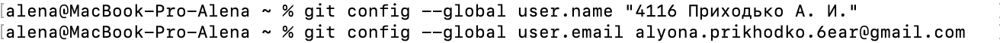

#LR6
##**Лабораторная работа №6**
##Ход работы
Создаётся аккаунт в github.com. Далее при помощи Fork создаётся копия в личное хранилище из https://github.com/Kurtyanik/LR6. С помощью команды git --version в консоли скачивается git. Клиент git настраивается при помощи команды git config. Вводится Фамилия. И. О. и электронная почта пользователя (Рис. 1). 
 
*Рис. 1 - Настройка клиента* 
Далее личный удаленный репозиторий клонируется на компьютер с помощью команды git clone (Рис. 2). 
 
*Рис. 2 - Клонирование личного удалённого репозитория* 
Посредством интерфейса GitHub создаётся новый файл file_1.txt. С помощью команды git pull продтягиваются изменения в локальный репозиторий (Рис. 3). 
.png) 
*Рис. 3 - Подтягивание изменений в локальный репозиторий* 
История операций для каждой из веток просматривается при помощи команды git log (Рис. 4, 6). Смена ветки же осуществляется с помощью команды git checkout (Рис. 5). 
 
*Рис. 4 - История операций для ветки master* 
 
*Рис. 5 - Смена ветки* 
 
*Рис. 6 - История операций для ветки branch1* 
Просмотр последних изменений для веток осуществляется посредством команды git show (Рис. 7, 8). 
 
*Рис. 7 - Просмотр последних изменений для ветки master* 
 
*Рис. 8 - Просмотр последних изменений для ветки branch1* 
Слияние веток производится с помощью команды git merge, но при её выполнении происходит конфликт (Рис. 9). Просмотреть, в каком файле произошёл конфликт, можно, применив команду git status(Рис. 10).  
 
*Рис. 9 - Конфликт при применении git merge* 
.png) 
*Рис. 10 - Файл с конфликтом* 
Для разрешения конфликта часть даных файла удаляется (Рис. 11, 12).  
 
*Рис. 11 - Окно файла с конфликтом* 
 
*Рис. 12 - Отредактированный файл* 
Далее для добавления файлов в индекс применяется команда git add, и для дополнительной проверки спорного файла ещё раз выполняется git status (Рис. 13). Для сохранения данных используется команда git commit(рис.14). 
 
*Рис. 13 - Сохранение файлов в индекс; статус спорного файла после разрешения конфликта* 
 
*Рис. 14 - Сохранение изменений* 
При следующей попытке выполнить команду git merge бесконфликтно происходит слияние в ветку master. 
 
*Рис. 15 - Слияние в ветку master* 
