# LR6

## **Лабораторная работа №6**

## Цель лаболаторной работы

изучение базовых возможностей системы управления версиями, опыт работы с Git Api, опыт работы с локальным и удаленным репозиториями.

## Ход работы

Создаётся аккаунт в github.com. Далее при помощи Fork создаётся копия в личное хранилище из https://github.com/Kurtyanik/LR6. С помощью команды git --version в консоли скачивается git. Клиент git настраивается при помощи команды git config. Вводится Фамилия. И. О. и электронная почта пользователя (Рис. 1).

*Рис. 1 - Настройка клиента*

Далее личный удаленный репозиторий клонируется на компьютер с помощью команды git clone (Рис. 2).

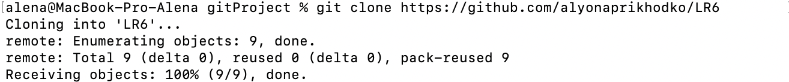
*Рис. 2 - Клонирование личного удалённого репозитория*

Посредством интерфейса GitHub создаётся новый файл file_1.txt. С помощью команды git pull продтягиваются изменения в локальный репозиторий (Рис. 3).

.png)
*Рис. 3 - Подтягивание изменений в локальный репозиторий*

История операций для каждой из веток просматривается при помощи команды git log (Рис. 4, 6). Смена ветки же осуществляется с помощью команды git checkout (Рис. 5).

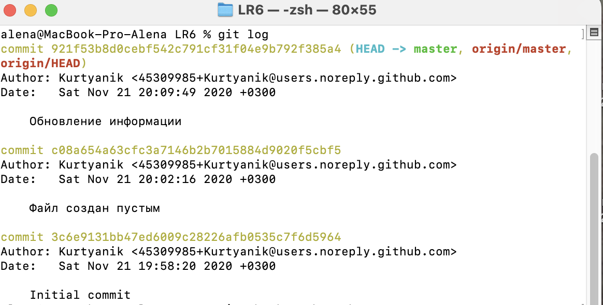
*Рис. 4 - История операций для ветки master*

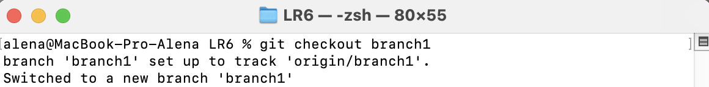
*Рис. 5 - Смена ветки*

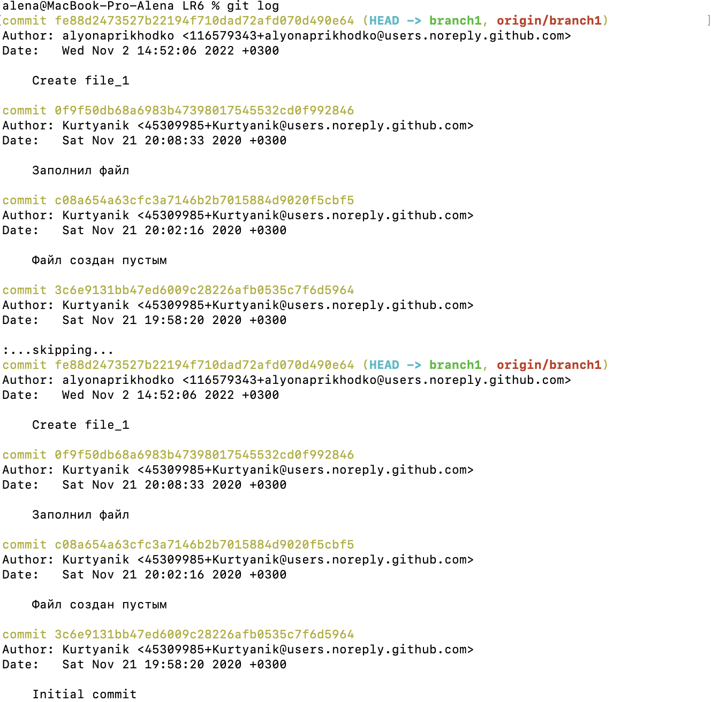
*Рис. 6 - История операций для ветки branch1*

Просмотр последних изменений для веток осуществляется посредством команды git show (Рис. 7, 8).

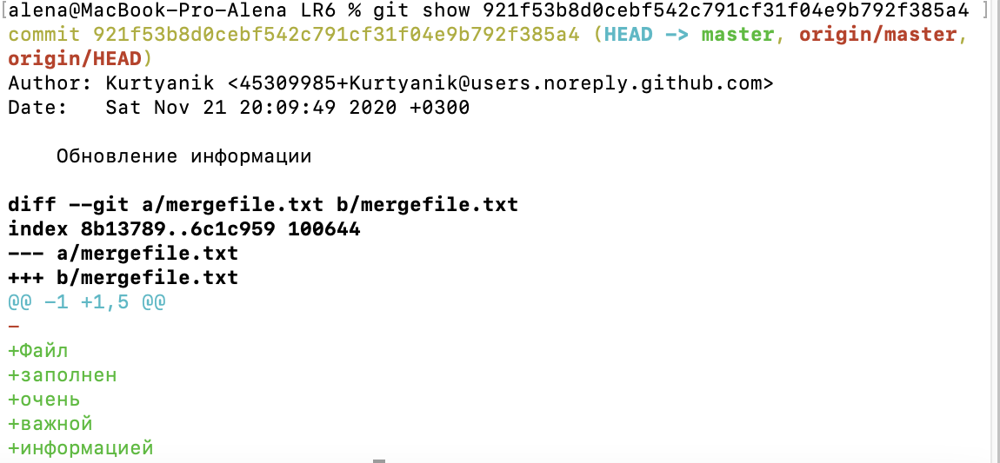
*Рис. 7 - Просмотр последних изменений для ветки master*

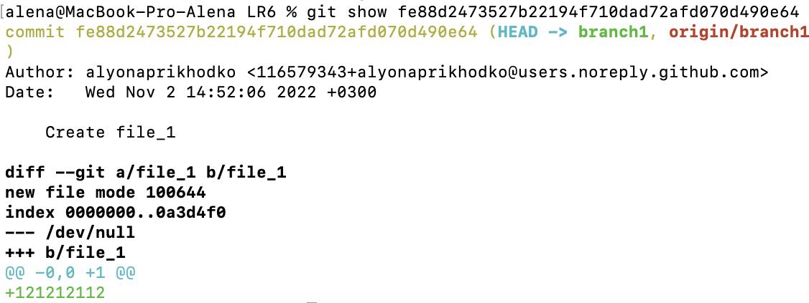
*Рис. 8 - Просмотр последних изменений для ветки branch1*

Слияние веток производится с помощью команды git merge, но при её выполнении происходит конфликт (Рис. 9). Просмотреть, в каком файле произошёл конфликт, можно, применив команду git status(Рис. 10).

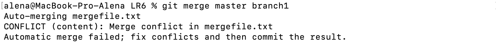
*Рис. 9 - Конфликт при применении git merge*

.png)
*Рис. 10 - Файл с конфликтом*

Для разрешения конфликта часть даных файла удаляется (Рис. 11, 12). 

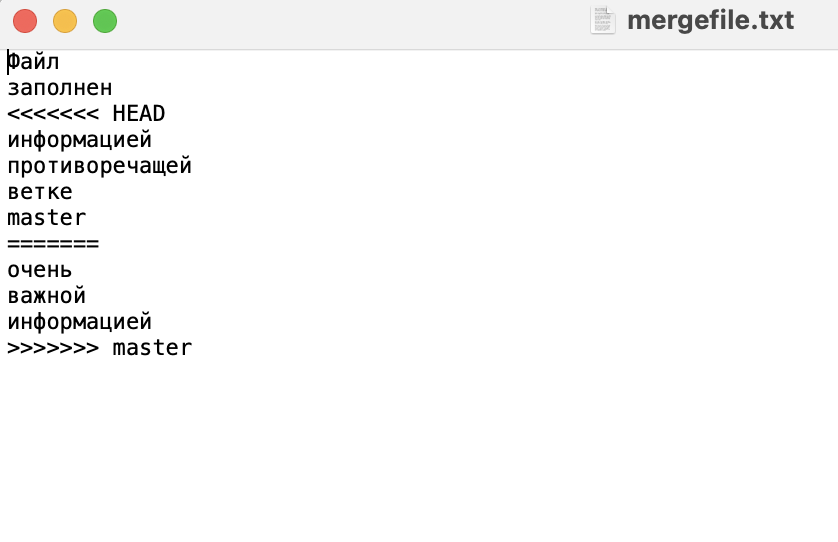
*Рис. 11 - Окно файла с конфликтом*

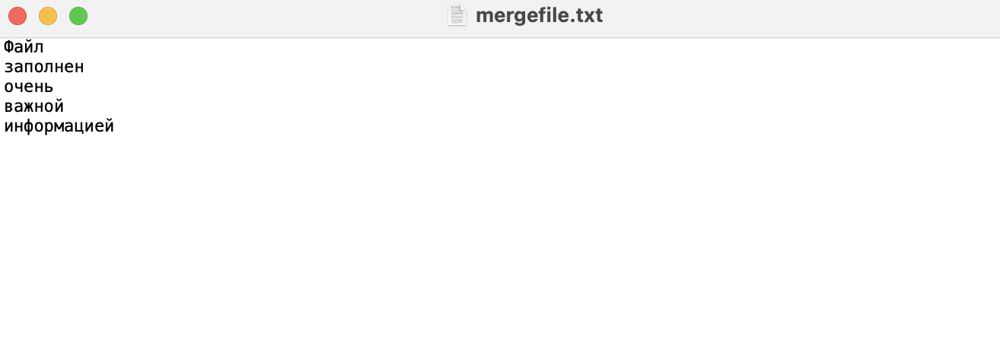
*Рис. 12 - Отредактированный файл*

Далее для добавления файлов в индекс применяется команда git add, и для дополнительной проверки спорного файла ещё раз выполняется git status (Рис. 13). Для сохранения данных используется команда git commit(рис.14).

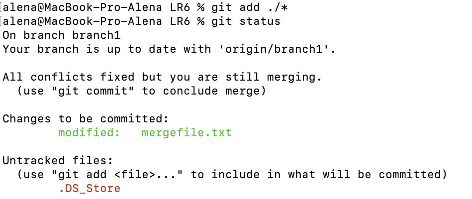
*Рис. 13 - Сохранение файлов в индекс; статус спорного файла после разрешения конфликта*

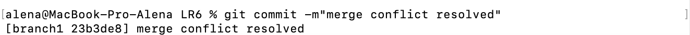
*Рис. 14 - Сохранение изменений*

При следующей попытке выполнить команду git merge бесконфликтно происходит слияние в ветку master.

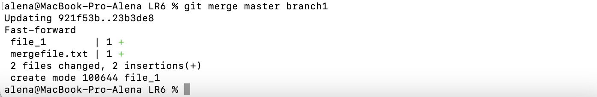
*Рис. 15 - Слияние в ветку master*

Далее вызывается команда git log --graph --all, чтобы увидеть визуализацию слияния в ветку master (Рис. 16).

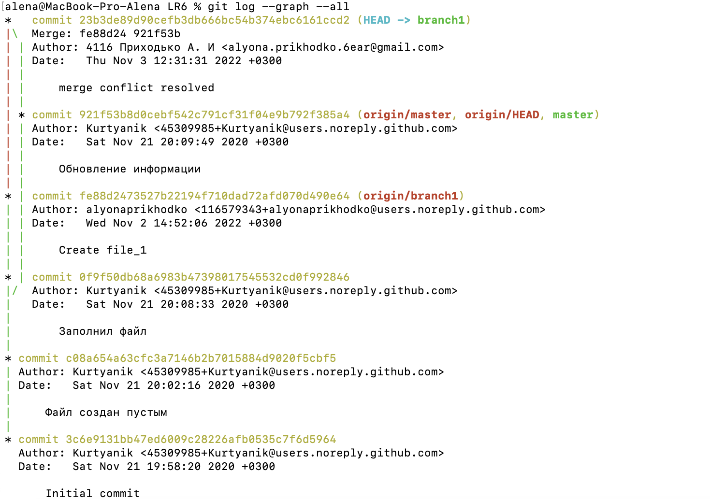
*Рис. 16 - Визуализация слияния*

После успешного слияния производится удаление побочной ветки (Рис. 17).

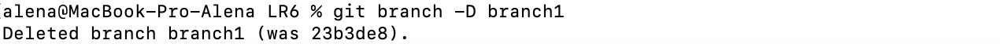
*Рис. 17 - Удаление побочной ветки*  

Внесение изменений происходит вручную в окне файла (Рис. 18, 19), а их фиксация - с помощью команд git add и git commit (Рис. 20, 21).

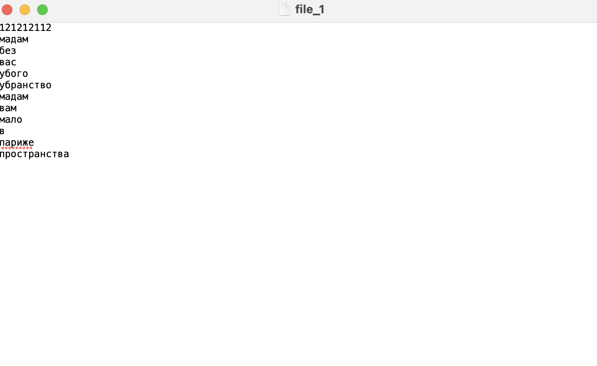
*Рис. 18 - Изменения в окне файла file_1*

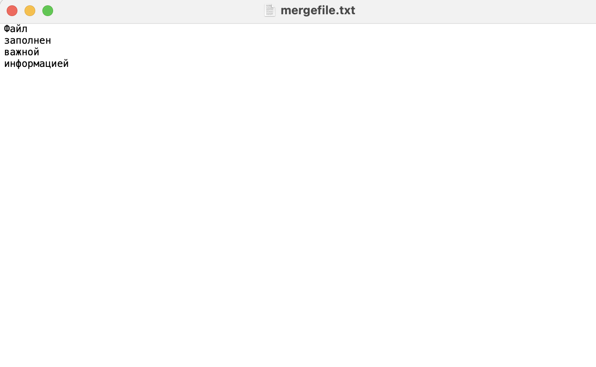
*Рис. 19 - Изменения в окне файла mergefile.txt*

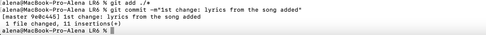
*Рис. 20 - Первый коммит*

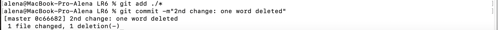
*Рис. 21 - Второй коммит*

Откат коммита совершается с помощью команды git reset (Рис. 22).

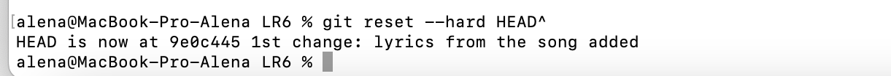
*Рис. 22 - Откат последнего коммита*

Новая ветка для отчёта так же, как и удаление побочной ветки (Рис. 17), создаётся с помощью команды git branch (Рис. 23).

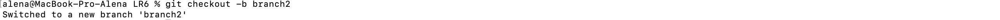
*Рис. 23 - Создание ветки для отчёта*

Скриншоты, используемые в отчёте, размещены в папке "git screens", размещённой в папке "LR6". Добавление папки так же происходит при помощи команд git add и git commit (Рис. 24).

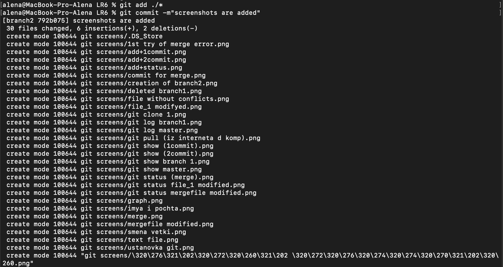
*Рис. 24 - Добавление папки*

По мере написания отчета создавались коммиты изменений(Рис. 25, 26).

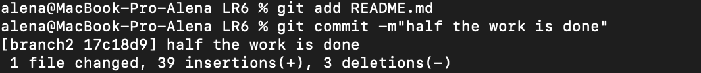
*Рис. 25 - Коммит первой половины работы*

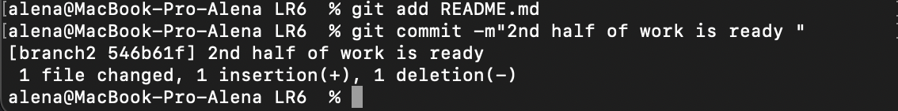
*Рис. 26 - Коммит второй половины работы*

История операций в виде сокращённый хэш + дата + имя автора + комментарий получена с помощью команды git log (Рис. 27).

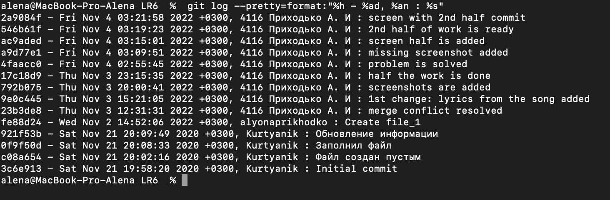
*Рис. 27 - Форматированная история операций*

## Вывод

Мы изучили базовые возможности системы управления версиями, получили опыт работы с Git Api и опыт работы с локальным и удаленным репозиториями.
